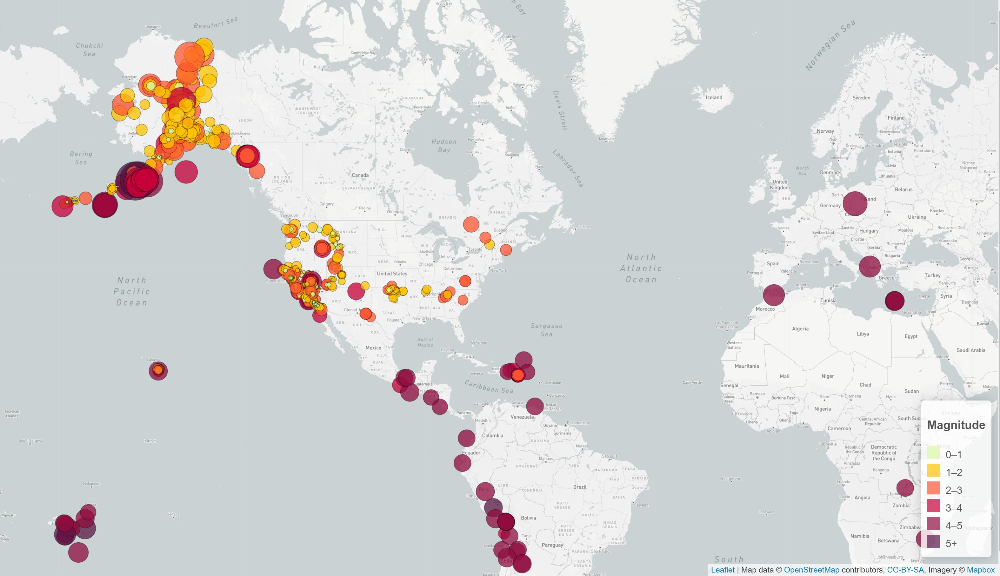
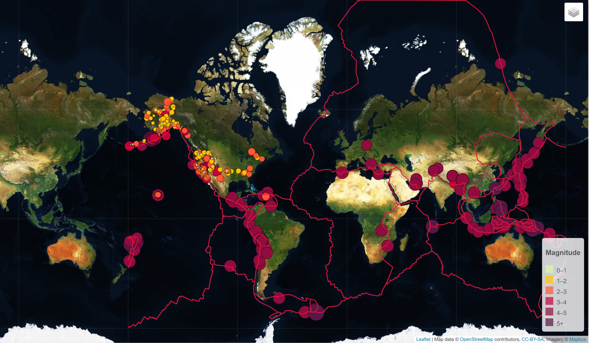
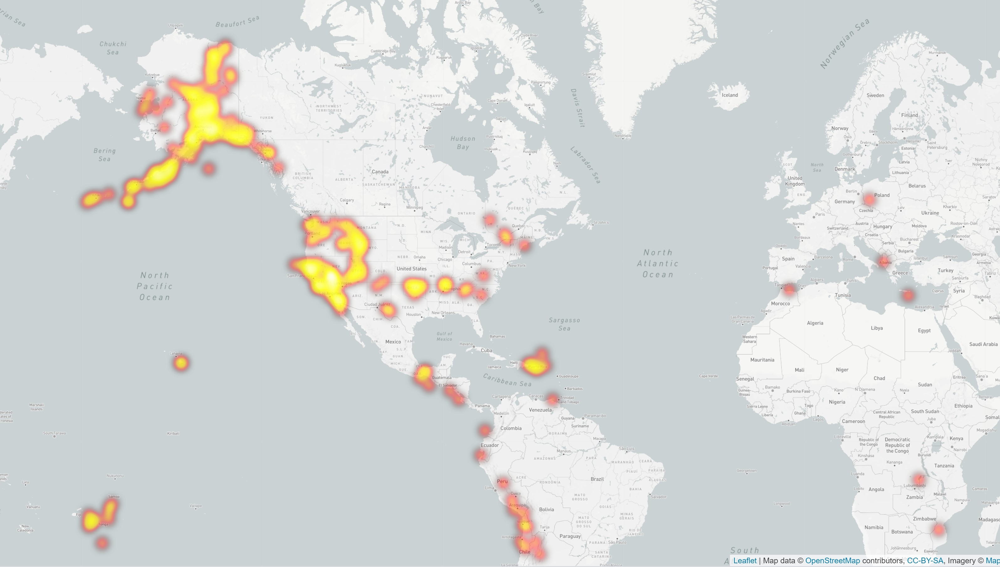

# leaflet-challenge

### Level 1: Basic Visualization

1. **Get your data set**

   We used USGS earthquake data from [here](http://earthquake.usgs.gov/earthquakes/feed/v1.0/geojson.php) page and picked 'All Earthquakes from the Past 7 Days' to visualize. We used the URL of this JSON to pull in the data for our visualization.

2. **Import & Visualize the Data**

   leaflet is used to plot all of the earthquakes from the data set based on their longitude and latitude. 

   * Data markers used to show the magnitude of the earthquake in their size and color. Earthquakes with higher magnitudes should appear larger and darker in color. In addition, we have pop ups with more information about each earthquake. 

   * A legend is used to show the different earthquake magnitudes.
   

- - -

### Level 2: Tectonic Data

We plot a second data set on your map to illustrate the relationship between tectonic plates and seismic activity. Data on tectonic plates can be found at <https://github.com/fraxen/tectonicplates>.

* Tectonic data has been added to earthquake layer in addition to grayscale and streetmap base maps. 

### Heatmap

